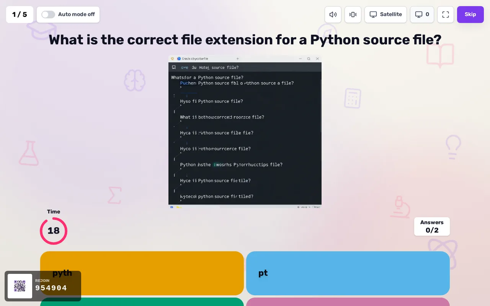
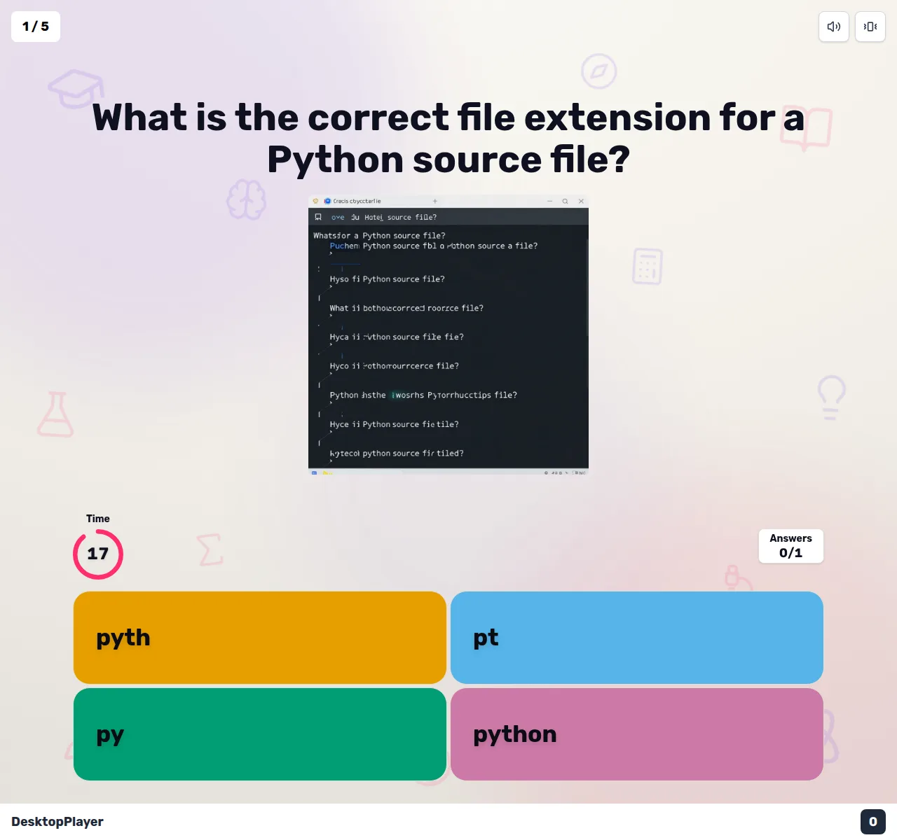
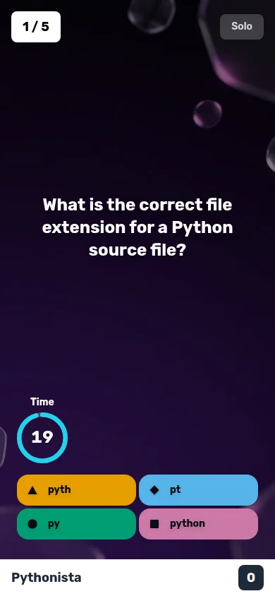
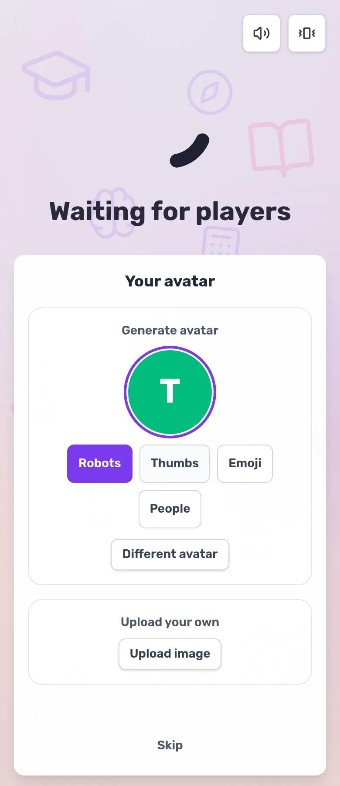
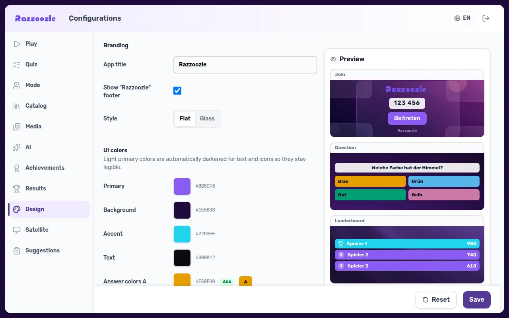
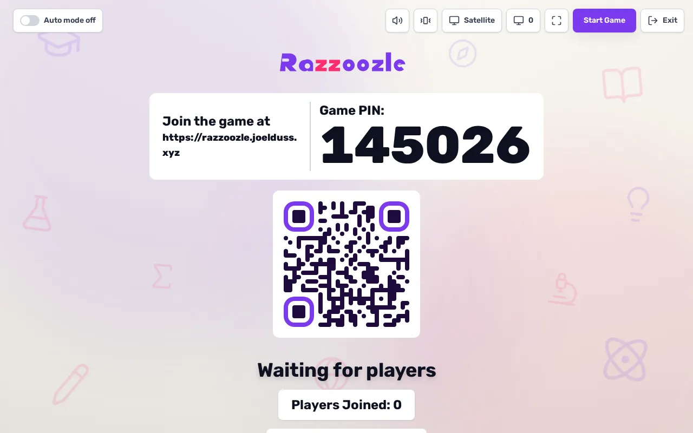

<div align="center">


# Razzoozle

### Une plateforme de quiz en direct, auto-hébergée et open-source — avec un design **cream** épuré et plat (et un thème liquid-glass en option).

🌐 [English](README.md) · [Deutsch](README.de.md) · [Español](README.es.md) · **Français** · [Italiano](README.it.md) · [中文](README.zh.md)

[](LICENSE)


**[▶ Démo en direct](https://razzoozle.joelduss.xyz)** · **[🖥️ Razzoozle Desktop — App Windows (Bêta)](https://github.com/joehomeskillet/razzoozle-desktop)** · **[🛰️ Gateway](https://github.com/joehomeskillet/razzloo-gateway)** · **[🌐 Vitrine](https://joehomeskillet.github.io/Razzoozle/)** · **[📚 Docs](docs/)** · **[Signaler un problème](https://github.com/joehomeskillet/Razzoozle/issues)** · *forké depuis [Ralex91/Razzia](https://github.com/Ralex91/Razzia)*

</div>

---

## 🧩 De quoi s'agit-il ?

Razzoozle est un **jeu de quiz** en temps réel et auto-hébergé pour les salles de classe, les événements et les soirées entre amis. Un hôte ouvre une partie sur le grand écran, les joueurs rejoignent depuis leur téléphone à l'aide d'un PIN, et tout le monde se dépêche de répondre — les bonnes réponses les plus rapides marquent plus de points. C'est un fork bienveillant de [**Ralex91/Razzia**](https://github.com/Ralex91/Razzia), reconstruit autour d'un design **cream** épuré et plat (le liquid-glass est désormais un thème optionnel), avec un système de thématisation piloté par le manager, de la gamification, des modes équipe et solo ainsi que de la génération d'images par IA locale — tout en conservant l'expérience classique façon Kahoot entre l'animateur et le téléphone (tuiles de réponse colorées avec des formes, un compte à rebours, un podium).

> Razzoozle est un projet open-source indépendant. Il n'est ni affilié, ni soutenu, ni lié à Kahoot!® ni à aucune autre plateforme de quiz commerciale.

---

## 📸 Captures d'écran

<div align="center">

| Animateur / hôte | Client de jeu sur ordinateur |
| :---: | :---: |
|  |  |

| Téléphone du joueur | Sélection d'avatar |
| :---: | :---: |
|  |  |





</div>

---

## ✦ Ce que Razzoozle ajoute par rapport à Razzia

| | Fonctionnalité |
| --- | --- |
| 🎨 | **Cockpit de thème** — un onglet « Design » en direct dans le manager : couleurs, arrière-plans par vue, logo, rayon et un sélecteur de style **Flat ⇄ Glass**, avec des presets (un **cream** plat par défaut + un preset violet **liquid-glass** en option) et des sélecteurs de couleurs conscients du contraste. |
| ☕ | **Design cream plat** — une interface cream chaleureuse et plate avec un arrière-plan animé vivant (blobs à la dérive + icônes flottantes d'école et de savoir), un logo/mot-symbole « Zig » plat et des tuiles de réponse encre-sur-cream. |
| 🧊 | **Interface liquid-glass** — une variante de thème glassmorphism optionnelle et héritée (surfaces dépolies et floutées) qui ne touche jamais à la base plate. |
| 🎯 | **Écrans de jeu fidèles à Kahoot** — des tuiles de réponse avec les icônes de formes classiques (triangle / losange / cercle / carré), un minuteur circulaire de compte à rebours, un compteur de réponses reçues et un podium animé. |
| 🧑‍🎨 | **Avatars des joueurs** — chaque joueur reçoit un avatar DiceBear généré (choisir un style + relancer, ou téléverser le vôtre) ; les avatars flottent dans le salon d'attente et apparaissent sur les classements, le podium et les récompenses. |
| 🏆 | **Gamification** — 15 succès, des médailles, des séries, des confettis et des carillons sonores, ainsi qu'une galerie de trophées personnelle. |
| 🥇 | **Récapitulatif des récompenses de fin de partie** — une séquence animée de superlatifs (doigt le plus rapide, plus gros grimpeur, plus longue série, roi du come-back…) montrant l'avatar + le nom de chaque gagnant, rythmée automatiquement en lecture automatique. |
| 👥 | **Mode équipe** — des équipes rouge / bleu / vert / jaune avec un classement d'équipe en direct. |
| 📱 | **Mode solo** — entraînez-vous seul à n'importe quel quiz via un lien de partage, avec son propre historique de scores. |
| ✍️ | **Plus de types de questions** — choix multiple, saisie de la réponse et curseur, en plus du choix unique classique. |
| 🔌 | **Système de plugins** — des add-ons ZIP installables par le manager avec leur propre onglet « Plugins ». |
| 🧩 | **Addons du manager** — téléversez, activez et configurez des addons JavaScript depuis la console du manager (onglet dédié, badges de capacités, configuration persistée) ; livré avec un squelette de démarrage à copier-coller (`examples/plugins/starter/`) accompagné d'un contrat de création. |
| 📦 | **ZIP de thème squelette** — téléchargez/téléversez un thème de jeu complet sous forme de ZIP lisible par LLM (« squelette » : jetons de design + CSS + JS + un contrat SKELETON.md). |
| 📳 | **Retour haptique mobile** — un retour par vibration optionnel sur les téléphones des joueurs (compte à rebours, réponses), conscient du mode mouvement réduit. |
| 🔗 | **Résultats partageables** — de riches aperçus de liens par résultat (déroulé Open Graph), une page de résultats avec des appels à l'action « jouez-y vous-même / hébergez le vôtre » et des autocollants de gagnant téléchargeables. |
| 🤝 | **Questions communautaires** — une page de soumission publique avec une file de modération côté manager, ainsi qu'un catalogue de questions réutilisable et une archive de quiz. |
| 🖼️ | **Images par IA locale** — générez des visuels de questions/thèmes sur l'appareil via ComfyUI (Z-Image), ou branchez des fournisseurs cloud — les clés restent côté serveur. |
| 🌍 | **6 langues + PWA** — anglais, allemand, français, espagnol, italien, chinois ; installable, conscient du hors-ligne. |
| 📺 | **Kiosque beamer + fiabilité** — une vue projecteur `/display`, un mode à faible latence, la récupération après plantage, la reconnexion et un serveur MCP pour le contrôle par des outils d'IA. |

Soutenu par **592 tests automatisés**, une passe de sécurité contre le path-traversal et la CVE de `ws`, une surface non authentifiée durcie (plafonds de joueurs par partie et de parties actives, points de terminaison publics à débit limité, limitation du brute-force de l'authentification manager) et un déploiement Docker contrôlé par l'état de santé. Testé en charge jusqu'à **600 joueurs simultanés**.

---

## 📲 Applications & compagnons

- **[Razzoozle Desktop](https://github.com/joehomeskillet/razzoozle-desktop) (Bêta)** — la première application de bureau native **Windows** pour Razzoozle. Hébergez et gérez vos parties depuis votre machine, sans navigateur.
- **[Razzoozle Gateway](https://github.com/joehomeskillet/razzloo-gateway)** — un léger service de rendez-vous / découverte qui aide les clients à se trouver. Découverte uniquement — il ne relaie jamais le jeu.

---

## ⚙️ Prérequis

**Avec Docker (recommandé) :** Docker + Docker Compose.
**Sans Docker :** Node.js 22+ et pnpm 11+.

---

## 📖 Pour commencer

### 🐳 Docker (recommandé)

```bash
git clone https://github.com/joehomeskillet/Razzoozle.git
cd Razzoozle
docker compose up -d
```

L'application démarre sur `http://127.0.0.1:3011` (nginx + le serveur socket dans un seul conteneur). La configuration et les données utilisateur résident dans le volume `./config`, créé et initialisé au premier démarrage. Placez-la derrière votre propre reverse proxy (Caddy, nginx, Traefik…) pour le TLS et un nom d'hôte public.

### 🛠️ Sans Docker

```bash
git clone https://github.com/joehomeskillet/Razzoozle.git
cd Razzoozle
pnpm install
pnpm build        # production build
pnpm start        # or: pnpm dev  (web + socket, hot reload)
```

---

## 🎮 Comment jouer

1. Ouvrez `/manager` sur la machine hôte et connectez-vous avec le mot de passe du manager.
2. Choisissez un quiz et démarrez une partie — un PIN apparaît (affichez-le sur le beamer via `/display`).
3. Les joueurs ouvrent le site sur leur téléphone, saisissent le PIN et un nom.
4. Répondez aussi vite que possible — les bonnes réponses les plus rapides marquent plus de points.
5. Suivez le classement, les médailles et les confettis entre les manches.

Vous préférez jouer seul ? Ouvrez le lien de partage **solo** de n'importe quel quiz et entraînez-vous à votre propre rythme.

---

## ⚙️ Configuration

Les données d'exécution résident dans `config/` (ignoré par git, initialisé au premier démarrage).

### Paramètres de jeu — `config/game.json`

```jsonc
{
  "managerPassword": "PASSWORD", // CHANGE THIS — the default blocks manager access
  "teamMode": false,             // enable red/blue/green/yellow teams
  "lowLatencyMode": { "enabled": false } // opt-in timing/UX tightening (see docs/LOW-LATENCY-MODE.md)
}
```

### Quiz — `config/quizz/*.json`

Créez des quiz dans l'éditeur du manager (recommandé) ou en JSON. Une question prend en charge plusieurs `type`s (`choice`, `boolean`, `slider`, plus le choix multiple via plusieurs `solutions`, et la saisie de la réponse) :

```jsonc
{
  "subject": "Python Basics",
  "questions": [
    {
      "question": "Which keyword defines a function in Python?",
      "type": "choice",
      "answers": ["func", "def", "function", "fun"],
      "solutions": [1],          // 0-based indices; multiple = multi-select
      "time": 20,                 // seconds to answer (5–120)
      "cooldown": 5,              // seconds before the answer is revealed (3–15)
      "media": { "type": "image", "url": "https://placehold.co/600x400.png" } // optional
    }
  ]
}
```

Le fournisseur d'IA (désactivé / ComfyUI local / cloud) se configure dans l'onglet **IA** du manager ; les clés d'API sont stockées côté serveur dans `config/` et ne sont jamais envoyées aux clients.

---

## 📺 Affichage beamer / kiosque

`/display` rend la présentation de l'hôte en plein écran pour un projecteur ou une télévision (typographie mise à l'échelle en vh, lisible à travers une pièce), couplable depuis un téléphone. La route `/satellite/<gameId>` est une vue kiosque sans commandes qui s'authentifie avec un jeton (pas de mot de passe manager). Une image satellite optionnelle pour Raspberry Pi est incluse.

---

## 🧱 Pile technique

Un monorepo pnpm — **`@razzoozle/web`** (React + Vite + Tailwind v4, TanStack Router, PWA), **`@razzoozle/socket`** (Node + Socket.IO + Express, snapshots de récupération après plantage), **`@razzoozle/common`** (types partagés validés par Zod) et **`@razzoozle/mcp`** (un serveur MCP pour le contrôle par des outils d'IA). Livré sous forme d'une seule image Docker (nginx + node via supervisord) avec un point de terminaison `/healthz` + un `HEALTHCHECK` Docker.

---

## 🤝 Contribuer

Les issues et les pull requests sont les bienvenues. Lancez `pnpm verify` (typecheck + lint + tests) avant d'ouvrir une PR.

---

## ⭐ Historique des étoiles

<a href="https://star-history.com/#joehomeskillet/Razzoozle&Date">
  
</a>

---

## 📝 Crédits & licence

Razzoozle est un fork de [**Ralex91/Razzia**](https://github.com/Ralex91/Razzia) — un grand merci aux auteurs amont. Publié sous la **[licence MIT](LICENSE)** (© 2024 Ralex, © 2026 Razzoozle contributors) ; la mention MIT amont est conservée.
