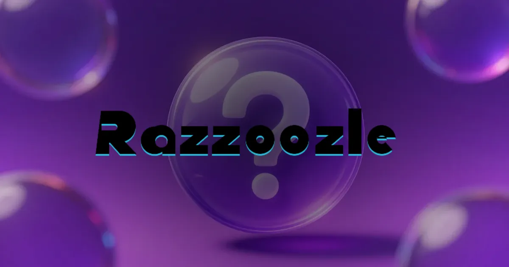
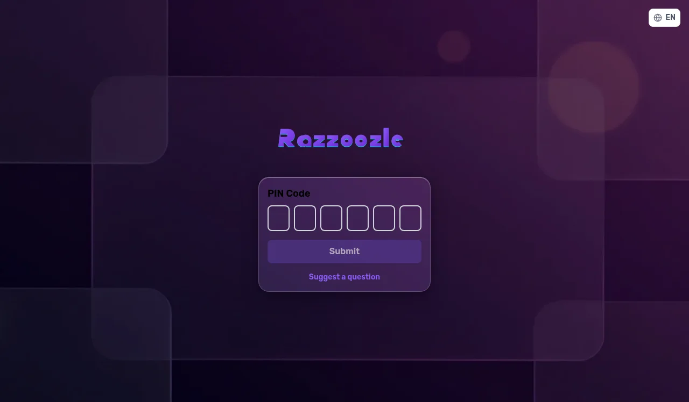
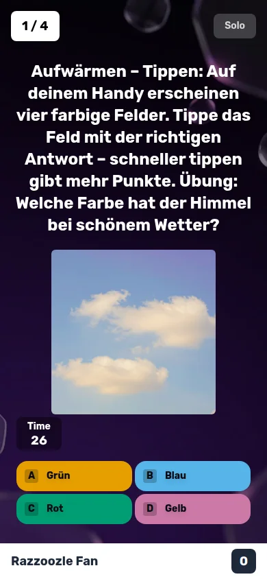
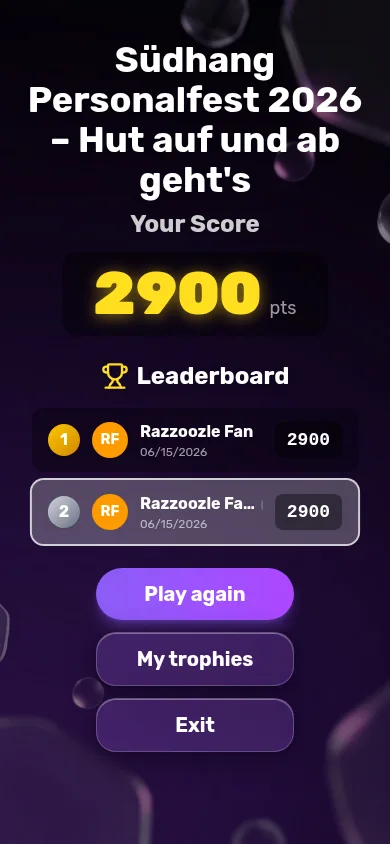

<div align="center">



# Razzoozle

**一个自托管、开源的实时答题平台 —— 采用紫色液态玻璃界面。**

🌐 [English](README.md) · [Deutsch](README.de.md) · **中文**

[](LICENSE)


[在线演示](https://razzoozle.joelduss.xyz) · [反馈问题](https://github.com/joehomeskillet/Razzoozle/issues)

</div>

---

## 🧩 这是什么？

Razzoozle 是一个自托管的实时**答题游戏**，适用于课堂、活动和聚会：主持人在大屏幕上开局，玩家用手机输入 PIN 码加入，大家比拼谁答得又快又准。它是 [**Ralex91/Razzia**](https://github.com/Ralex91/Razzia) 的友好分支，围绕独特的**紫色液态玻璃**外观重新打造，并加入了由主持人驱动的主题系统、游戏化机制、单人模式以及本地 AI 图像生成。

> Razzoozle 是一个独立的开源项目，与 Kahoot!® 或任何其他商业答题平台均无关联、未获其背书，也不存在任何从属关系。

<div align="center">



</div>

---

## ✦ Razzoozle 相比 Razzia 的改进

在上游 Razzia 基础上，本分支带来的改进简要、如实地汇总如下：

| | 功能 |
| --- | --- |
| 🎨 | **主题驾驶舱** —— 实时的主持人「设计」标签页：颜色、各视图背景、Logo、圆角，以及**扁平 ⇄ 玻璃**风格切换；内置预设（紫色**液态玻璃**预设 + 扁平默认预设），并配有对比度感知的取色器。 |
| 🧊 | **液态玻璃界面** —— 可选的玻璃拟态主题变体（磨砂、模糊的表面），且绝不影响扁平基线外观。 |
| 🏆 | **游戏化** —— 15 项成就、奖牌、连胜、彩带与音效提示，以及个人奖杯陈列馆。 |
| 👥 | **团队模式** —— 红 / 蓝 / 绿 / 黄 四队，配有实时团队排行榜。 |
| 📱 | **单人模式** —— 通过分享链接独自练习任意题库，并拥有独立的得分记录。 |
| ✍️ | **更多题型** —— 在经典单选与滑块之外，新增多选与填空作答。 |
| 🤝 | **社区出题** —— 公开的投稿页面 + 主持人审核队列，外加可复用的题目目录与测验归档。 |
| 🖼️ | **本地 AI 图像** —— 通过 ComfyUI（Z-Image）在本地生成题目/主题图像，或接入云端提供商 —— 密钥始终保存在服务端。 |
| 🌍 | **6 种语言 + PWA** —— 英语、德语、法语、西班牙语、意大利语、中文；可安装、支持离线。 |
| 📺 | **投影仪模式 + 可靠性** —— 专用的 `/display` 投影视图、低延迟模式、崩溃恢复、断线重连，以及用于 AI 工具控制的 MCP 服务器。 |

以上全部由 **350+ 项自动化测试** 和带健康检查的 Docker 部署保驾护航。

---

## ⚙️ 前置条件

**使用 Docker（推荐）：** Docker + Docker Compose。
**不使用 Docker：** Node 22+ 和 pnpm 11+。

---

## 📖 快速开始

### Docker（推荐）

```bash
git clone https://github.com/joehomeskillet/Razzoozle.git
cd Razzoozle
docker compose up -d
```

这会构建镜像并在 `http://127.0.0.1:3011` 启动应用（nginx 与 socket 服务运行在同一容器中）。配置与用户数据保存在 `./config` 卷里，首次启动时会自动创建并初始化。

请将其置于你自己的反向代理（Caddy、nginx、Traefik 等）之后，以启用 TLS 和公开域名。

### 不使用 Docker

```bash
git clone https://github.com/joehomeskillet/Razzoozle.git
cd Razzoozle
pnpm install
pnpm build
pnpm start
```

开发模式（Web + socket 热重载）：`pnpm dev`。

---

## 🎮 如何游玩

1. 在主机上打开 `/manager`，用主持人密码登录（位于 `config/game.json`）。
2. 选择一个题库并开局 —— 屏幕上会显示 PIN 码（可通过 `/display` 投影到大屏）。
3. 玩家在手机上打开网站，输入 PIN 码和昵称。
4. 尽快作答 —— 越快答对，得分越高。
5. 在每轮之间欣赏排行榜、奖牌和彩带。

想独自练习？打开任意题库的**单人**分享链接，按自己的节奏练习。

---

## ⚙️ 配置

运行时数据保存在 `config/`（已被 git 忽略，首次启动时初始化）：

- `config/game.json` —— 游戏规则 + 主持人密码。
- `config/quizz/*.json` —— 你的题库。
- `config/theme/theme.json` —— 当前主题（也可在「设计」标签页选择预设）。
- `config/ai-settings.json` —— AI 提供商选择（密钥单独存储，绝不发送给客户端）。

一个题库就是纯 JSON —— 例如：

```jsonc
{
  "subject": "General knowledge",
  "questions": [
    {
      "question": "What colour is the sky on a clear day?",
      "type": "choice",
      "answers": ["Green", "Blue", "Red", "Yellow"],
      "solution": 1,
      "time": 15,
      "cooldown": 5
    }
  ]
}
```

你也可以在主持人界面中创建题库、用 AI 生成图像，或接受社区投稿。

---

## 🧱 技术栈

一个 pnpm monorepo：**`@razzoozle/web`**（React + Vite + Tailwind v4、TanStack Router、PWA）、**`@razzoozle/socket`**（Node + Socket.IO + Express）、**`@razzoozle/common`**（共享的 Zod 校验类型），以及 **`@razzoozle/mcp`**（用于 AI 工具控制的 MCP 服务器）。以单个 Docker 镜像发布（通过 supervisord 运行 nginx + node）。

---

## 📝 致谢与许可

Razzoozle 是 [**Ralex91/Razzia**](https://github.com/Ralex91/Razzia) 的分支 —— 衷心感谢上游作者。基于 **[MIT 许可证](LICENSE)** 发布（© 2024 Ralex，© 2026 Razzoozle 贡献者）。上游的 MIT 声明予以保留。

欢迎贡献 —— 提交 issue 或 pull request。
